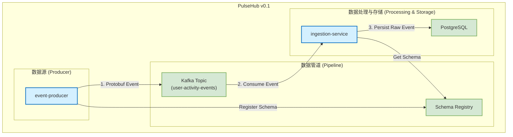

# Gemini's Project Brief: PulseHub

**Objective:** Act as the Tech Lead/Architect to guide the user (Mid-level/Senior Middleware Engineer) in building PulseHub, a scalable, event-driven CRM middleware platform.

---

## 1. Core Project Overview

- **Product:** **PulseHub**, a CRM middleware system inspired by HubSpot, designed to process and analyze user behavior data.
- **Methodology:** We simulate a ticket-driven agile workflow. I provide architectural guidance, and the user implements the features.
- **Tech Stack:** Java 21, Spring Boot 3, Maven, Kafka, PostgreSQL, Docker, Protobuf.
- **Key Conventions:**
    - **Environment Variables:** Read from `env-config.txt` (user maintains sync with `.env`).
    - **Task Source of Truth:** `v0.2-vision-and-plan.md` currently contains the active roadmap.

---

## 2. Current State: v0.1 (Completed MVP)

The v0.1 milestone established a foundational, end-to-end data pipeline.

### v0.1 Architecture



### v0.1 Component Summary

-   **`event-producer`**: Simulates clients, sending `UserActivityEvent` messages.
-   **`ingestion-service`**: Consumes events from Kafka, deserializes them, and saves them to PostgreSQL.
-   **`common`**: A shared Maven module containing the `user_activity_event.proto` data contract.
-   **Infrastructure (`docker-compose.yml`)**: Contains Kafka (KRaft mode), PostgreSQL, Schema Registry, and the application services.

---

## 3. Next Steps: v0.2 Vision

The primary goal of v0.2 is to evolve from simple data collection to a **real-time user profile platform** by implementing a **Hot/Cold Path Architecture**.

### v0.2 Target Architecture

```mermaid
graph TD
    subgraph "数据源"
        A[Web/App Clients] --> B(Event Producer)
    end

    B --> C{Kafka: user-activity-events}

    subgraph "热路径 (Hot Path - Real-time)"
        direction LR
        C --> D[Stream Processor <br/>(Kafka Streams)] --> E((Redis))
        E <--> F[Profile Service API]
    end

    subgraph "冷路径 (Cold Path - Archival)"
        direction LR
        C --> G[Ingestion Service <br/>(Archiver)] --> H[(PostgreSQL)]
    end
    
    subgraph "配置中心"
        I[Config Server]
    end

    I -.-> D & F & G
```

### v0.2 Plan & Key Changes

-   **Hot Path**: A new `stream-processor` service (using Kafka Streams) will perform real-time calculations on events and store the results (enriched user profiles) in **Redis**. The `profile-service` will be refactored to read from Redis for low-latency API responses.
-   **Cold Path**: The existing `ingestion-service` will be repurposed as a data archiver, consuming raw events from Kafka and persisting them to PostgreSQL for analytics and long-term storage.
-   **Centralized Configuration**: A new `config-server` (Spring Cloud Config) will be introduced to manage configuration for all microservices.

### v0.2 High-Level Roadmap

1.  **Task 7: Set up Redis Caching Layer**: Integrate Redis for caching user profiles.
2.  **Task 10 & 14: Create User Profile Model & Repository**: Define the `UserProfile` entity and its PostgreSQL repository for the cold path.
3.  **Task 9: Configure Multi-Topic Kafka**: Set up new Kafka topics for processed data (e.g., `profile-updates`).
4.  **Task 12: Develop Real-time Event Processor**: Implement the core stream processing logic with Kafka Streams.
5.  **Task 11, 15, 19...: Implement User Profile Service**: Refactor the service to use the Hot/Cold path, reading from Redis with a fallback to PostgreSQL.
6.  **Task 13, 16, 20...: Implement Profile REST API**: Expose the user profile data via a low-latency REST API.
7.  **Task 18: Implement Centralized Configuration**: Set up the Spring Cloud Config server.
