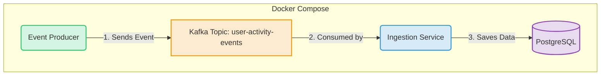

# PulseHub - Statement of Work (SOW)

*This is a living document and will be updated continuously as the project evolves.*

## 1. Executive Summary & Project Mandate

### 1.1. Project Background
PulseHub is envisioned as the core data middleware for a larger SaaS ecosystem, conceptually similar to the internal data platforms that power companies like HubSpot. In our simulated context, we are the dedicated engineering team responsible for building and maintaining this critical infrastructure. Our "customers" are other internal product teams (e.g., Marketing Hub, Sales Hub) who rely on our platform to provide unified, reliable, and timely customer data.

### 1.2. Business Problem & Value Proposition
In a modern digital business, customer data is generated across numerous touchpoints (websites, mobile apps, backend systems, third-party tools), creating disconnected data silos. This fragmentation prevents a unified understanding of the customer journey, leading to inefficient marketing, missed sales opportunities, and poor customer service.

PulseHub is designed to solve this problem by providing a central nervous system for customer data. Its core value proposition is to:
- **Ingest** data from any source.
- **Identify** and merge customer identities into a single profile.
- **Enrich** profiles with behavioral and transactional data.
- **Segment** audiences based on any attribute or behavior.
- **Activate** this data by syncing it to downstream tools.

### 1.3. Our Mission
Our mission is to build a highly scalable, robust, and performant data middleware. The focus is on **backend architecture excellence**, not UI implementation. All data and user requests will be simulated to allow for a pure focus on system design and engineering.

## 2. Development Philosophy & Methodology

To ensure the project experience is logical, realistic, and mirrors real-world agile development, we will adopt the following structured, iterative methodology:

**Phase 1: Foundation (MVP Construction)**
1.  **Objective:** To build the skeletal architecture of PulseHub. This initial version will establish a basic, end-to-end data pipeline, serving as the foundational infrastructure.
2.  **Scope:** This phase focuses on creating the core components necessary for data to flow through the system (e.g., event producers, a basic ingestion service, messaging queues, and a database), orchestrated via `docker-compose`. Many downstream services will be mocked.
3.  **Outcome:** A runnable, Minimum Viable Product (MVP) representing the state of the system at the moment of our "new hire's" (the user's) onboarding.

**Phase 2: Iterative Development (Ticket-Driven Sprints)**
1.  **Onboarding Simulation:** Once the MVP is complete, we will simulate the user's "official start" as a Mid-level/Senior Middleware Engineer on the team.
2.  **Squad-Based Work:** We will operate as a two-person agile "squad". The AI will act as the Tech Lead/Architect, and the user will be the core developer.
3.  **Ticket-Driven Workflow:** All new features, enhancements, and architectural improvements will be introduced via "tickets" (similar to Jira tickets).
4.  **Development Cycle per Ticket:** For each ticket, we will follow a complete, realistic development lifecycle: Analysis & Design, Implementation, Testing, and Delivery.

This methodology ensures that every piece of code we write is tied to a specific business need and that the PulseHub platform evolves organically, feature by feature, just as it would in a real-world, high-performing tech company.

## 3. Phase 1: The MVP - Laying the Foundation

### 3.1. MVP Goals & Success Criteria
The objective of the MVP is **not** to deliver a feature-rich product, but to **establish a foundational, event-driven architecture** that is stable, observable, and ready for future extension.

**Success of the MVP will be measured by these criteria:**
- [ ] **End-to-End Data Flow:** A test event can be produced, published to Kafka, consumed by the `ingestion-service`, and correctly persisted in the PostgreSQL database.
- [ ] **"One-Command" Launch:** The entire stack (services, Kafka, database) can be reliably launched with a single `docker-compose up` command.
- [ ] **Architectural Readiness:** The codebase is structured as a multi-module Maven project, making it easy to add new services and shared libraries in subsequent phases.
- [ ] **Basic Observability:** Service logs are accessible and provide clear information about the events being processed.

### 3.2. MVP Architecture Diagram

### 3.3. MVP Implementation Plan & Tasks

This plan details the one-story-point tasks required to build the MVP.

#### 3.3.1. Project Setup
- [ ] Initialize a multi-module Maven project structure (`pulse-hub-parent`, `ingestion-service`, `event-producer`).
- [ ] Create the root `pom.xml` to manage dependencies for all sub-modules.

#### 3.3.2. Infrastructure as Code (Docker)
- [ ] Create a `docker-compose.yml` file in the project root.
- [ ] Add service definitions for `kafka` and `zookeeper`.
- [ ] Add a service definition for `postgres`.
- [ ] Configure networking and volumes to ensure persistence and communication.

#### 3.3.3. Core Data Model
- [ ] Define the `UserActivityEvent.java` POJO in a shared module.
- [ ] Create a corresponding JPA Entity `TrackedEvent.java` in the ingestion service.

#### 3.3.4. Ingestion Service (`ingestion-service`)
- [ ] Set up the Spring Boot application with necessary dependencies (`web`, `data-jpa`, `kafka`, `postgres-driver`).
- [ ] Configure `application.yml` for database and Kafka connections.
- [ ] Implement the `KafkaConsumerService` and the `TrackedEventRepository`.
- [ ] Implement the core logic to consume, convert, and save events.

#### 3.3.5. Event Producer (`event-producer`)
- [ ] Set up a simple application to produce `UserActivityEvent` objects.
- [ ] Configure its Kafka connection and implement the sending logic.

#### 3.3.6. Documentation & Finalization
- [ ] Update the main `README.md` with instructions on how to run the MVP.
- [ ] Perform a full end-to-end test to verify data flow.

---
*Instructions: This SOW.md file should be updated as tasks are completed. Check off the boxes to reflect the current progress of the project.* 