# PulseHub - Statement of Work (SOW)

*This is a living document and will be updated continuously as the project evolves.*

## 1. Executive Summary & Project Mandate

### 1.1. Project Background
PulseHub is envisioned as the core data middleware for a larger SaaS ecosystem, conceptually similar to the internal data platforms that power companies like HubSpot. In our simulated context, we are the dedicated engineering team responsible for building and maintaining this critical infrastructure. Our "customers" are other internal product teams (e.g., Marketing Hub, Sales Hub) who rely on our platform to provide unified, reliable, and timely customer data.

### 1.2. Business Problem & Value Proposition
In a modern digital business, customer data is generated across numerous touchpoints (websites, mobile apps, backend systems, third-party tools), creating disconnected data silos. This fragmentation prevents a unified understanding of the customer journey, leading to inefficient marketing, missed sales opportunities, and poor customer service.

PulseHub is designed to solve this problem by providing a central nervous system for customer data. Its core value proposition is to:
- **Ingest** data from any source.
- **Identify** and merge customer identities into a single profile.
- **Enrich** profiles with behavioral and transactional data.
- **Segment** audiences based on any attribute or behavior.
- **Activate** this data by syncing it to downstream tools.

### 1.3. Our Mission
Our mission is to build a highly scalable, robust, and performant data middleware. The focus is on **backend architecture excellence**, not UI implementation. All data and user requests will be simulated to allow for a pure focus on system design and engineering.

## 2. Development Philosophy & Methodology

To ensure the project experience is logical, realistic, and mirrors real-world agile development, we will adopt the following structured, iterative methodology:

**Phase 1: Foundation (MVP Construction)**
1.  **Objective:** To build the skeletal architecture of PulseHub. This initial version will establish a basic, end-to-end data pipeline, serving as the foundational infrastructure.
2.  **Scope:** This phase focuses on creating the core components necessary for data to flow through the system (e.g., event producers, a basic ingestion service, messaging queues, and a database), orchestrated via `docker-compose`. Many downstream services will be mocked.
3.  **Outcome:** A runnable, Minimum Viable Product (MVP) representing the state of the system at the moment of our "new hire's" (the user's) onboarding.

**Phase 2: Iterative Development (Ticket-Driven Sprints)**
1.  **Onboarding Simulation:** Once the MVP is complete, we will simulate the user's "official start" as a Mid-level/Senior Middleware Engineer on the team.
2.  **Squad-Based Work:** We will operate as a two-person agile "squad". The AI will act as the Tech Lead/Architect, and the user will be the core developer.
3.  **Ticket-Driven Workflow:** All new features, enhancements, and architectural improvements will be introduced via "tickets" (similar to Jira tickets).
4.  **Development Cycle per Ticket:** For each ticket, we will follow a complete, realistic development lifecycle: Analysis & Design, Implementation, Testing, and Delivery.

This methodology ensures that every piece of code we write is tied to a specific business need and that the PulseHub platform evolves organically, feature by feature, just as it would in a real-world, high-performing tech company.

## 3. Phase 1: The MVP - Laying the Foundation

### 3.1. MVP Goals & Success Criteria
The objective of the MVP is **not** to deliver a feature-rich product, but to **establish a foundational, event-driven architecture** that is stable, observable, and ready for future extension.

**Success of the MVP will be measured by these criteria:**
- [x] **End-to-End Data Flow:** A test event can be produced, published to Kafka, consumed by the `ingestion-service`, and correctly persisted in the PostgreSQL database.
- [x] **"One-Command" Launch:** The entire stack (services, Kafka, database) can be reliably launched with a single `docker-compose up` command.
- [x] **Architectural Readiness:** The codebase is structured as a multi-module Maven project, making it easy to add new services and shared libraries in subsequent phases.
- [x] **Basic Observability:** Service logs are accessible and provide clear information about the events being processed.

### 3.2. MVP Architecture Diagram


### 3.3. MVP Implementation Plan & Tasks

This plan details the one-story-point tasks required to build the MVP.

#### 3.3.1. Project Setup
- [x] Initialize a multi-module Maven project structure (`pulse-hub-parent`, `ingestion-service`, `event-producer`).
- [x] Create the root `pom.xml` to manage dependencies for all sub-modules.

#### 3.3.2. Infrastructure as Code (Docker)
- [x] Create a `docker-compose.yml` file in the project root.
- [x] Add service definitions for `kafka` and `zookeeper`.
- [x] Add a service definition for `postgres`.
- [x] Configure networking and volumes to ensure persistence and communication.

#### 3.3.3. Core Data Model
- [x] Define the `UserActivityEvent.java` POJO in a shared module.
- [x] Create a corresponding JPA Entity `TrackedEvent.java` in the ingestion service.

#### 3.3.4. Ingestion Service (`ingestion-service`)
- [x] Set up the Spring Boot application with necessary dependencies (`web`, `data-jpa`, `kafka`, `postgres-driver`).
- [x] Configure `application.yml` for database and Kafka connections.
- [x] Implement the `KafkaConsumerService` and the `TrackedEventRepository`.
- [x] Implement the core logic to consume, convert, and save events.

#### 3.3.5. Event Producer (`event-producer`)
- [x] Set up a simple application to produce `UserActivityEvent` objects.
- [x] Configure its Kafka connection and implement the sending logic.

#### 3.3.6. Documentation & Finalization
- [x] Update the main `README.md` with instructions on how to run the MVP.
- [x] Perform a full end-to-end test to verify data flow.

---
*Instructions: This SOW.md file should be updated as tasks are completed. Check off the boxes to reflect the current progress of the project.*

## 4. Phase 2: Iterative Development

This phase marks the transition from foundational setup to feature-driven development. Work will be organized into "tickets," simulating an agile sprint workflow.

### 4.1. Ticket #8: Implement User Profile Service

- **Goal:** To create a new `profile-service` responsible for managing unique user profiles, shifting the platform from being event-centric to user-centric.

#### 4.1.1. `profile-service` Standalone Development
- [x] **Structure**: Create the `profile-service` Maven module and directory structure.
- [x] **Configuration**: Create `pom.xml` and basic `application.yml`.
- [x] **Data Layer**: Define the `UserProfile` entity and `UserProfileRepository`.
- [x] **Business Layer**: Implement the `ProfileService` for core logic.
- [x] **API Layer**: Create the `ProfileController` to expose REST endpoints.
- [x] **Containerization**: Create a `Dockerfile` for the service.

#### 4.1.2. System Integration & Verification
- [ ] **Docker Integration**: Add `profile-service` to `docker-compose.yml` with necessary configurations.
- [ ] **Build & Launch Verification**:
    - [ ] Run `mvn clean install` to ensure all modules, including the new service, build successfully.
    - [ ] Run `docker-compose up --build` to verify the `profile-service` can launch and connect to the database without errors.

#### 4.1.3. `ingestion-service` Enhancement
- [ ] **HTTP Client Setup**: Configure a  `WebClient` bean in `ingestion-service`.
- [ ] **Profile Check Logic**: In `KafkaConsumerService`, implement logic to call `profile-service`'s `GET /api/v1/profiles/{userId}` endpoint for each incoming event.
- [ ] **Profile Creation Logic**: If the profile check returns a 404 Not Found, call the `POST /api/v1/profiles` endpoint to create a new user profile.

#### 4.1.4. End-to-End Testing
- [ ] **Final System Validation**:
    - [ ] Launch the complete system.
    - [ ] Monitor logs to confirm `ingestion-service` is correctly calling `profile-service`.
    - [ ] Query the `user_profiles` table in PostgreSQL to verify that new user profiles are created as expected.

## 5. Phase v0.2: Real-time Processing & Infrastructure Hardening

This phase evolves PulseHub from a simple data ingestion system into a real-time data processing middleware, laying the groundwork for intelligent data activation.

### 5.1. v0.2 Goals & Success Criteria
- **Real-time Insights**: The system must be able to process raw event streams in real-time to compute and update user attributes (e.g., Last Active Time, Page View Count).
- **High-Performance Caching**: A caching layer must be implemented in the `profile-service` to provide low-latency access to user profile data.
- **Architectural Clarity**: The system architecture will be refactored into clear "hot" (real-time) and "cold" (archival) data paths.

### 5.2. v0.2 Architecture Diagram

```mermaid
graph LR
    %% === Kafka 中枢 ===
    Kafka["🧭 Kafka"]
    style Kafka fill:#ddeeff,stroke:#3366cc,stroke-width:2px

    %% === 缓存与数据库 ===
    Redis["🧠 Redis<br/>对象缓存 / 排行榜 / Feed流"]
    PostgreSQL["🗄️ PostgreSQL<br/>用户主数据 / 归档存储"]
    style Redis fill:#e0ffe0,stroke:#339933,stroke-width:2px
    style PostgreSQL fill:#e6e6ff,stroke:#6666cc,stroke-width:2px

    %% === 应用服务 ===
    StreamProcessor["🧪 stream-processor"]
    ProfileService["👤 profile-service"]
    IngestionService["📥 ingestion-service"]
    EventProducer["🧨 event-producer"]

    style StreamProcessor fill:#f0f8ff,stroke:#339,stroke-width:1.5px
    style ProfileService fill:#f0f8ff,stroke:#339,stroke-width:1.5px
    style IngestionService fill:#f0f8ff,stroke:#339,stroke-width:1.5px
    style EventProducer fill:#f0f8ff,stroke:#339,stroke-width:1.5px

    %% === 数据流动链 ===
    EventProducer -- "🔄 Raw Events" --> Kafka
    Kafka -- "Raw Events" --> StreamProcessor
    StreamProcessor -- "Writes State" --> Redis
    StreamProcessor -- "Enriched Events" --> Kafka
    Kafka -- "Enriched Events" --> ProfileService

    ProfileService -- "Cache Ops" --> Redis
    ProfileService -- "R/W Master Data" --> PostgreSQL

    Kafka -- "Raw Events<br/>(for archival)" --> IngestionService
    IngestionService -- "Archive to DB" --> PostgreSQL

```



### 5.3. v0.2 Implementation Plan & Tasks

This implementation plan is derived directly from our `task-master` project management tool and represents the single source of truth for development work in this phase.

- [x] **Task 7: Set up Redis Caching Layer** ✅ **COMPLETED**
  - **Description**: Integrate Redis as a high-performance, in-memory data store for caching user profiles and supporting real-time operations.
  - **Dependencies**: None
  - **Implementation**: Enterprise-grade multi-tier caching architecture with business-scenario-driven configuration
  - **Code Quality**: 4,500+ lines of production-ready code with comprehensive testing
  - **Subtasks**:
    - [x] **7.1**: Configure Redis connection properties ✅
    - [x] **7.2**: Implement Redis connection factory and template ✅
    - [x] **7.3**: Develop cache service abstraction layer ✅
    - [x] **7.4**: Implement TTL policies and eviction strategies ✅
    - [x] **7.5**: Implement Redis health checks and monitoring ✅

### 5.3.1. Task 7 Implementation Excellence & Best Practices

**Task 7已完成，实现质量远超预期，展现了企业级Redis缓存层的最佳实践。**

#### 🏗️ 架构设计亮点

**1. 业务场景驱动的分层缓存策略**
```yaml
# CRM场景: 高实时性要求
crm-user-profiles:
  ttl: PT10M          # 10分钟
  cacheNullValues: false
  
# Analytics场景: 稳定性优先
analytics-user-profiles:
  ttl: PT4H           # 4小时
  cacheNullValues: true
  
# 行为跟踪: 平衡性能
user-behaviors:
  ttl: PT30M          # 30分钟
  cacheNullValues: false
  
# 系统配置: 长期稳定
system-configs:
  ttl: PT24H          # 24小时
  cacheNullValues: true
```

**2. 企业级配置架构**
- **连接池优化**: Jedis连接池精细调优，支持高并发
- **序列化策略**: JSON序列化，兼顾性能与可读性
- **键名规范**: 分层命名空间 `pulsehub:{scenario}:{key}`
- **健康检查**: Redis容器状态监控和自动重连


#### 📚 教学价值实现

**提供了三类学习材料：**

1. **注解式缓存演示** (`CacheableParametersExample.java`)
   - `@Cacheable`参数详解
   - 条件缓存和键生成策略
   - TTL和空值处理策略

2. **手动缓存操作** (`ManualCacheExample.java`)
   - `RedisTemplate`直接操作
   - 数据结构操作演示
   - 原子操作和事务处理

3. **对比测试框架** (`AnnotationVsManualTest.java`)
   - 注解式 vs 手动缓存性能对比
   - 不同场景下的最佳选择
   - 实际业务场景模拟

#### 💡 技术决策记录

| 决策点 | 选择 | 理由 |
|--------|------|------|
| 序列化方式 | JSON | 可读性强，便于调试 |
| 连接池 | Jedis | 成熟稳定，性能优秀 |
| 缓存策略 | 场景化配置 | 支持不同业务需求 |
| 键命名 | 分层命名空间 | 便于管理和监控 |
| 测试方法 | 端到端脚本 | 验证真实运行环境 |

**实施建议：** Task 7的实现方案可作为后续微服务的缓存层标准模板，特别是分层缓存策略和测试验证体系值得在整个项目中推广。

- [ ] **Task 9: Configure Multi-Topic Kafka Environment** 🎯 **CRITICAL PATH TASK**
  
  我们在实现 task 9 期间: 另外完成了 infrastructure-service,  discovery-service 的搭建,  
  
  - **Description**: Restructure the Kafka environment to handle multiple topics, separating raw events (user-activity-events) from processed results (profile-updates).
  - **Dependencies**: None
  - **Complexity Score**: 7/10 (High complexity due to infrastructure coordination)
  - **Estimated Duration**: 11-17 days (Critical Path)
  - **Business Impact**: Enables hot/cold path separation and real-time processing capabilities
  
  **Subtasks (Topologically Sorted by Dependencies):**
      
      **🟢 Level 1 - Foundation (Days 1-2)**
        - [x] **9.1**: Define and create Kafka topics
      - **Dependencies**: None (Entry Point)
  - **Duration**: 1-2 days
  - **Deliverables**: `user-activity-events`, `profile-updates`, `device-classifications` topics
  - **Key Technologies**: Kafka AdminClient, TopicBuilder API
      
      **🟡 Level 2 - Partitioning Strategy (Days 3-5)**
        - [ ] **9.2**: Design partitioning strategy
      - **Dependencies**: 9.1 ✅ (Requires topics to exist)
  - **Duration**: 2-3 days
  - **Deliverables**: User-ID based hash partitioning, optimal partition count calculation
  - **Key Decisions**: 30 partitions per topic, UserBasedPartitioner implementation
      
      **🔵 Level 3 - Reliability Configuration (Days 6-7)**
        - [ ] **9.3**: Configure replication and durability settings
      - **Dependencies**: 9.1, 9.2 ✅ (Requires topics and partitioning strategy)
  - **Duration**: 1-2 days
  - **Deliverables**: 3-replica setup, min.insync.replicas=2, acks=all configuration
  - **Risk Mitigation**: Data loss prevention, broker failure tolerance
      
      **🟣 Level 4 - Error Handling (Days 8-11)**
        - [ ] **9.4**: Implement error handling and retry mechanisms
      - **Dependencies**: 9.1, 9.2, 9.3 ✅ (Requires complete topic infrastructure)
  - **Duration**: 3-4 days
  - **Deliverables**: Dead Letter Queue setup, exponential backoff retry, idempotent consumers
  - **Critical Features**: @RetryableTopic annotation, circuit breaker pattern
      
      **🔴 Level 5 - Monitoring Infrastructure (Days 12-14)**
        - [ ] **9.5**: Set up monitoring and alerting
      - **Dependencies**: 9.3, 9.4 ✅ (Requires stable infrastructure + error handling)
  - **Duration**: 2-3 days
  - **Deliverables**: JMX metrics, Prometheus integration, Grafana dashboards
  - **Monitoring Scope**: Broker health, consumer lag, error rates, throughput metrics
      
      **⚫ Level 6 - Application Integration (Days 15-17)**
        - [ ] **9.6**: Integrate Kafka with Spring Boot application
      - **Dependencies**: 9.4, 9.5 ✅ (Requires error handling + monitoring)
  - **Duration**: 2-3 days
  - **Deliverables**: KafkaTemplate configuration, @KafkaListener setup, transaction support
  - **Integration Points**: profile-service, stream-processor, ingestion-service
  
  **🎯 Critical Path Analysis:**
  ```
  9.1 → 9.2 → 9.3 → 9.4 → 9.5 → 9.6 (Sequential Dependencies)
  Total Duration: 11-17 days (All subtasks on critical path)
  ```
  
  **🔗 Downstream Task Impact:**
  - **Task 12** (Real-time Event Processor): Depends on 9.1, 9.2, 9.4
  - **Task 15** (Cold Path Persistence): Depends on 9.1, 9.3
  - **Task 25** (Event-Driven Cache): Depends on 9.1, 9.6
  
  **📊 Success Metrics:**
  - [ ] All 3 topics created with correct partition/replica configuration
  - [ ] Message throughput: >10,000 events/second per topic
  - [ ] Consumer lag: <100ms under normal load
  - [ ] Error rate: <0.1% message processing failures
  - [ ] Recovery time: <30 seconds from broker failure
  
- [ ] **Task 10: Create User Profile Model**
  - **Description**: Design and implement the User Profile data model to store enriched user attributes including lastActiveAt timestamp, page view counter, and device classification.
  - **Dependencies**: None
  - **Subtasks**:
    - [ ] **10.1**: Define User Profile Core Attributes
    - [ ] **10.2**: Implement Serialization/Deserialization Methods
    - [ ] **10.3**: Develop Helper Methods and Utility Functions

- [ ] **Task 11: Implement User Profile Service**
  - **Description**: Create a service to manage user profiles, including methods to retrieve, update, and cache user profile data.
  - **Dependencies**: Task 7, Task 10
  - **Subtasks**:
    - [ ] **11.1**: Define User Profile Service Interface
    - [ ] **11.2**: Implement Redis Integration for Profile Caching
    - [ ] **11.3**: Implement Database Fallback Mechanism
    - [ ] **11.4**: Develop Exception Handling Framework
    - [ ] **11.5**: Implement Cache Update Strategies

- [ ] **Task 12: Develop Real-time Event Processor**
  - **Description**: Implement a Kafka consumer service that processes incoming UserActivityEvents in real-time to update user profiles with enriched data.
  - **Dependencies**: Task 9, Task 11
  - **Subtasks**:
    - [ ] **12.1**: Configure Kafka Consumer
    - [ ] **12.2**: Implement Core Event Processing Logic
    - [ ] **12.3**: Develop User Profile Update Mechanism
    - [ ] **12.4**: Implement Comprehensive Error Handling
    - [ ] **12.5**: Set Up Monitoring and Alerting
    - [ ] **12.6**: Optimize Performance and Scalability

- [ ] **Task 13: Implement Profile REST API**
  - **Description**: Create a REST API to expose user profile data with low latency, leveraging the Redis cache for performance.
  - **Dependencies**: Task 11
  - **Subtasks**:
    - [ ] **13.1**: Implement Profile Controller
    - [ ] **13.2**: Implement Input Validation
    - [ ] **13.3**: Implement Error Handling
    - [ ] **13.4**: Create API Documentation

- [ ] **Task 14: Implement Profile Database Repository**
  - **Description**: Create a repository layer to persist user profiles in PostgreSQL as part of the cold path for long-term storage and analytics.
  - **Dependencies**: Task 10
  - **Subtasks**:
    - [ ] **14.1**: Define Entity Classes
    - [ ] **14.2**: Create Repository Interfaces
    - [ ] **14.3**: Implement Database Migration Scripts
    - [ ] **14.4**: Implement Custom Query Methods
    - [ ] **14.5**: Implement Error Handling

- [ ] **Task 15: Implement Cold Path Persistence Service**
  - **Description**: Create a service to persist raw event data to PostgreSQL for long-term storage and future analytics as part of the cold path architecture.
  - **Dependencies**: Task 9
  - **Subtasks**:
    - [ ] **15.1**: Implement Kafka Consumer Setup
    - [ ] **15.2**: Develop Batch Processing Logic
    - [ ] **15.3**: Create Entity Transformation Layer
    - [ ] **15.4**: Implement Error Handling and Recovery
    - [ ] **15.5**: Set Up Monitoring and Metrics

- [ ] **Task 17: Implement Device Type Classification Service**
  - **Description**: Create a service to classify device types from user agent strings to enrich user profiles with device information.
  - **Dependencies**: None
  - **Subtasks**:
    - [ ] **17.1**: Integrate User Agent Parsing Library
    - [ ] **17.2**: Implement Device Classification Logic
    - [ ] **17.3**: Implement Caching Mechanism
    - [ ] **17.4**: Develop Fallback Classification Strategies

- [ ] **Task 18: Implement Monitoring and Alerting**
  - **Description**: Set up comprehensive monitoring and alerting for all components of the system, focusing on the new real-time processing capabilities.
  - **Dependencies**: Task 7, Task 9, Task 11, Task 12
  - **Subtasks**:
    - [ ] **18.1**: Prometheus Integration Setup
    - [ ] **18.2**: Grafana Dashboard Implementation
    - [ ] **18.3**: Alert Configuration and Notification Channels
    - [ ] **18.4**: Custom Application Metrics Implementation
    - [ ] **18.5**: Health Check System Implementation
    - [ ] **18.6**: Log Aggregation and Analysis Setup

- [ ] **Task 19: Implement Hot/Cold Path Integration**
  - **Description**: Create the integration between the hot path (real-time processing) and cold path (archival storage) to ensure data consistency and completeness.
  - **Dependencies**: Task 12, Task 14, Task 15
  - **Subtasks**:
    - [ ] **19.1**: Design and implement reconciliation service
    - [ ] **19.2**: Develop data backfill mechanism
    - [ ] **19.3**: Implement discrepancy monitoring and alerting
    - [ ] **19.4**: Design and implement recovery process
    - [ ] **19.5**: Implement comprehensive audit logging
    - [ ] **19.6**: Develop testing framework and validation suite

- [ ] **Task 20: Create System Documentation**
  - **Description**: Develop comprehensive documentation for the new system architecture, including the hot/cold path design, configuration management, and real-time processing capabilities.
  - **Dependencies**: Task 7, Task 9, Task 10, Task 11, Task 12, Task 13, Task 14, Task 15, Task 17, Task 18, Task 19
  - **Subtasks**:
    - [ ] **20.1**: Create Architecture Diagrams
    - [ ] **20.2**: Develop Configuration Documentation
    - [ ] **20.3**: Write API Documentation
    - [ ] **20.4**: Develop Operational Runbooks
    - [ ] **20.5**: Create Troubleshooting Guides

- [ ] **Task 21: Implement End-to-End Testing Suite**
  - **Description**: Create a comprehensive end-to-end testing suite to validate the entire system flow from event ingestion to profile enrichment and data persistence.
  - **Dependencies**: Task 12, Task 13, Task 15, Task 19
  - **Subtasks**:
    - [ ] **21.1**: Set up test environment
    - [ ] **21.2**: Develop test data generation framework
    - [ ] **21.3**: Implement core test scenarios
    - [ ] **21.4**: Develop assertion and validation framework
    - [ ] **21.5**: Implement performance testing suite
    - [ ] **21.6**: Develop chaos testing capabilities

### 5.4. Ticket #15: Implement Spring Boot Admin for Centralized Monitoring

- **Goal**: To establish a centralized monitoring dashboard for all microservices within the PulseHub ecosystem, enhancing observability and simplifying operational management.
- **Priority**: High
- **Dependencies**: Successful implementation of Actuator in participating services (e.g., as part of Task 7.5).

#### 5.4.1. `admin-server` Module Setup
- [ ] **Structure**: Create a new Maven module named `admin-server`.
- [ ] **Dependencies**: Add `spring-boot-admin-starter-server` and `spring-boot-starter-web` to its `pom.xml`.
- [ ] **Configuration**: In `AdminServerApplication.java`, add the `@EnableAdminServer` annotation.
- [ ] **Application Properties**: Configure a unique server port (e.g., 9090) in `application.yml` to avoid conflicts.
- [ ] **Containerization**: Create a `Dockerfile` for the `admin-server`.

#### 5.4.2. Client Integration
- [ ] **Add Dependencies**: Add the `spring-boot-admin-starter-client` dependency to the `pom.xml` of all existing and future microservices (e.g., `profile-service`, `ingestion-service`, `config-server`).
- [ ] **Configure Clients**: In the `application.yml` of each microservice, configure the `spring.boot.admin.client.url` to point to the `admin-server` (e.g., `http://admin-server:9090`).
- [ ] **Expose Actuator Endpoints**: Ensure the `management.endpoints.web.exposure.include` property in each client's configuration includes not just `health`, but `*` to provide the Admin UI with full access to all actuator details.

#### 5.4.3. Docker Compose Integration
- [ ] **Add Service**: Add the new `admin-server` to the main `docker-compose.yml` file.
- [ ] **Configure Networking**: Ensure it is part of the `pulsehub-network` and can be reached by other services via its service name.
- [ ] **Verification**: Launch the entire stack with `docker-compose up --build` and verify that all services successfully register themselves with the Spring Boot Admin dashboard, accessible at `http://localhost:9090`.

### 5.5. Task #30: Implement Service Discovery Development Environment with Eureka

- **Goal**: Create a service discovery-based development environment using Eureka that enables local development services to connect seamlessly to infrastructure services running in Docker containers.
- **Priority**: High
- **Status**: ► in-progress
- **Dependencies**: Task 7, Task 9, Task 25
- **Complexity**: High

#### 5.5.1. Implementation Plan
- [✓] **30.1**: Configure and Deploy Eureka Server in Docker with High Availability (Completed)
  - Create discovery-service Spring Boot module with Eureka Server
  - Configure standalone and clustered deployment options
  - Implement resilience patterns for high availability
  - Set up Docker configuration for the discovery service

- [►] **30.2**: Implement Service Registration for Local and Dockerized Services (In Progress)
  - Create common configuration for Eureka clients
  - Implement environment-aware service registration
  - Configure client-side discovery mechanisms
  - Ensure proper health check integration

- [ ] **30.3**: Register Infrastructure Services with Eureka
  - Configure service registration sidecars for infrastructure services
  - Implement discovery adapters for PostgreSQL, Redis, and Kafka
  - Set up health checks for infrastructure components
  - Create dynamic service resolution for infrastructure services

- [ ] **30.4**: Configure Service Discovery Clients with Abstraction Layer
  - Implement service discovery abstraction layer
  - Configure fallback mechanisms for resilience
  - Implement circuit breakers for service communication
  - Create client-side load balancing strategy

- [ ] **30.5**: Document Development Environment and Troubleshooting
  - Create comprehensive developer guide for using service discovery
  - Document common issues and their resolutions
  - Create example implementations and templates
  - Develop onboarding tutorial for new developers

#### 5.5.2. Key Technologies & Implementation Details

**Eureka Server Setup:**
- Spring Cloud Eureka Server with self-preservation mode configured for development
- High availability configuration with peer awareness
- Security configuration with appropriate credentials
- Dashboard customization for better visibility

**Service Registration:**
- Spring Cloud Eureka Client for Spring Boot services
- Custom registration mechanisms for non-JVM services
- Environment-aware instance ID generation
- Metadata-enriched service registration

**Network Configuration:**
- Docker and local network bridging
- DNS resolution strategies
- Consistent naming conventions
- Service URL mapping

**Cross-Environment Communication:**
- Consistent service resolution between local and Docker environments
- Network address translation handling
- Timeout and retry strategies
- Security configuration across network boundaries

**Implementation Deliverables:**
- discovery-service module with Eureka Server
- Common client configuration library
- Infrastructure service registration sidecars
- Service discovery abstraction layer
- Comprehensive documentation and examples

---
**Note:** This SOW is a living document. Please update the checkboxes as tasks are completed to reflect the real-time progress of the project. 