# PulseHub - Statement of Work (SOW)

*This is a living document and will be updated continuously as the project evolves.*

## 1. Executive Summary & Project Mandate

### 1.1. Project Background
PulseHub is envisioned as the core data middleware for a larger SaaS ecosystem, conceptually similar to the internal data platforms that power companies like HubSpot. In our simulated context, we are the dedicated engineering team responsible for building and maintaining this critical infrastructure. Our "customers" are other internal product teams (e.g., Marketing Hub, Sales Hub) who rely on our platform to provide unified, reliable, and timely customer data.

### 1.2. Business Problem & Value Proposition
In a modern digital business, customer data is generated across numerous touchpoints (websites, mobile apps, backend systems, third-party tools), creating disconnected data silos. This fragmentation prevents a unified understanding of the customer journey, leading to inefficient marketing, missed sales opportunities, and poor customer service.

PulseHub is designed to solve this problem by providing a central nervous system for customer data. Its core value proposition is to:
- **Ingest** data from any source.
- **Identify** and merge customer identities into a single profile.
- **Enrich** profiles with behavioral and transactional data.
- **Segment** audiences based on any attribute or behavior.
- **Activate** this data by syncing it to downstream tools.

### 1.3. Our Mission
Our mission is to build a highly scalable, robust, and performant data middleware. The focus is on **backend architecture excellence**, not UI implementation. All data and user requests will be simulated to allow for a pure focus on system design and engineering.

## 2. Development Philosophy & Methodology

To ensure the project experience is logical, realistic, and mirrors real-world agile development, we will adopt the following structured, iterative methodology:

**Phase 1: Foundation (MVP Construction)**
1.  **Objective:** To build the skeletal architecture of PulseHub. This initial version will establish a basic, end-to-end data pipeline, serving as the foundational infrastructure.
2.  **Scope:** This phase focuses on creating the core components necessary for data to flow through the system (e.g., event producers, a basic ingestion service, messaging queues, and a database), orchestrated via `docker-compose`. Many downstream services will be mocked.
3.  **Outcome:** A runnable, Minimum Viable Product (MVP) representing the state of the system at the moment of our "new hire's" (the user's) onboarding.

**Phase 2: Iterative Development (Ticket-Driven Sprints)**
1.  **Onboarding Simulation:** Once the MVP is complete, we will simulate the user's "official start" as a Mid-level/Senior Middleware Engineer on the team.
2.  **Squad-Based Work:** We will operate as a two-person agile "squad". The AI will act as the Tech Lead/Architect, and the user will be the core developer.
3.  **Ticket-Driven Workflow:** All new features, enhancements, and architectural improvements will be introduced via "tickets" (similar to Jira tickets).
4.  **Development Cycle per Ticket:** For each ticket, we will follow a complete, realistic development lifecycle: Analysis & Design, Implementation, Testing, and Delivery.

This methodology ensures that every piece of code we write is tied to a specific business need and that the PulseHub platform evolves organically, feature by feature, just as it would in a real-world, high-performing tech company.

## 3. Phase 1: The MVP - Laying the Foundation

### 3.1. MVP Goals & Success Criteria
The objective of the MVP is **not** to deliver a feature-rich product, but to **establish a foundational, event-driven architecture** that is stable, observable, and ready for future extension.

**Success of the MVP will be measured by these criteria:**
- [x] **End-to-End Data Flow:** A test event can be produced, published to Kafka, consumed by the `ingestion-service`, and correctly persisted in the PostgreSQL database.
- [x] **"One-Command" Launch:** The entire stack (services, Kafka, database) can be reliably launched with a single `docker-compose up` command.
- [x] **Architectural Readiness:** The codebase is structured as a multi-module Maven project, making it easy to add new services and shared libraries in subsequent phases.
- [x] **Basic Observability:** Service logs are accessible and provide clear information about the events being processed.

### 3.2. MVP Architecture Diagram

### 3.3. MVP Implementation Plan & Tasks

This plan details the one-story-point tasks required to build the MVP.

#### 3.3.1. Project Setup
- [x] Initialize a multi-module Maven project structure (`pulse-hub-parent`, `ingestion-service`, `event-producer`).
- [x] Create the root `pom.xml` to manage dependencies for all sub-modules.

#### 3.3.2. Infrastructure as Code (Docker)
- [x] Create a `docker-compose.yml` file in the project root.
- [x] Add service definitions for `kafka` and `zookeeper`.
- [x] Add a service definition for `postgres`.
- [x] Configure networking and volumes to ensure persistence and communication.

#### 3.3.3. Core Data Model
- [x] Define the `UserActivityEvent.java` POJO in a shared module.
- [x] Create a corresponding JPA Entity `TrackedEvent.java` in the ingestion service.

#### 3.3.4. Ingestion Service (`ingestion-service`)
- [x] Set up the Spring Boot application with necessary dependencies (`web`, `data-jpa`, `kafka`, `postgres-driver`).
- [x] Configure `application.yml` for database and Kafka connections.
- [x] Implement the `KafkaConsumerService` and the `TrackedEventRepository`.
- [x] Implement the core logic to consume, convert, and save events.

#### 3.3.5. Event Producer (`event-producer`)
- [x] Set up a simple application to produce `UserActivityEvent` objects.
- [x] Configure its Kafka connection and implement the sending logic.

#### 3.3.6. Documentation & Finalization
- [x] Update the main `README.md` with instructions on how to run the MVP.
- [x] Perform a full end-to-end test to verify data flow.

---
*Instructions: This SOW.md file should be updated as tasks are completed. Check off the boxes to reflect the current progress of the project.*

## 4. Phase 2: Iterative Development

This phase marks the transition from foundational setup to feature-driven development. Work will be organized into "tickets," simulating an agile sprint workflow.

### 4.1. Ticket #8: Implement User Profile Service

- **Goal:** To create a new `profile-service` responsible for managing unique user profiles, shifting the platform from being event-centric to user-centric.

#### 4.1.1. `profile-service` Standalone Development
- [x] **Structure**: Create the `profile-service` Maven module and directory structure.
- [x] **Configuration**: Create `pom.xml` and basic `application.yml`.
- [x] **Data Layer**: Define the `UserProfile` entity and `UserProfileRepository`.
- [x] **Business Layer**: Implement the `ProfileService` for core logic.
- [x] **API Layer**: Create the `ProfileController` to expose REST endpoints.
- [x] **Containerization**: Create a `Dockerfile` for the service.

#### 4.1.2. System Integration & Verification
- [ ] **Docker Integration**: Add `profile-service` to `docker-compose.yml` with necessary configurations.
- [ ] **Build & Launch Verification**:
    - [ ] Run `mvn clean install` to ensure all modules, including the new service, build successfully.
    - [ ] Run `docker-compose up --build` to verify the `profile-service` can launch and connect to the database without errors.

#### 4.1.3. `ingestion-service` Enhancement
- [ ] **HTTP Client Setup**: Configure a `RestTemplate` or `WebClient` bean in `ingestion-service`.
- [ ] **Profile Check Logic**: In `KafkaConsumerService`, implement logic to call `profile-service`'s `GET /api/v1/profiles/{userId}` endpoint for each incoming event.
- [ ] **Profile Creation Logic**: If the profile check returns a 404 Not Found, call the `POST /api/v1/profiles` endpoint to create a new user profile.

#### 4.1.4. End-to-End Testing
- [ ] **Final System Validation**:
    - [ ] Launch the complete system.
    - [ ] Monitor logs to confirm `ingestion-service` is correctly calling `profile-service`.
    - [ ] Query the `user_profiles` table in PostgreSQL to verify that new user profiles are created as expected.

## 5. Phase v0.2: Real-time Processing & Infrastructure Hardening

This phase evolves PulseHub from a simple data ingestion system into a real-time data processing middleware, laying the groundwork for intelligent data activation.

### 5.1. v0.2 Goals & Success Criteria
- **Real-time Insights**: The system must be able to process raw event streams in real-time to compute and update user attributes (e.g., Last Active Time, Page View Count).
- **Centralized Configuration**: All microservices must fetch their configuration from a central Config Server, eliminating local configuration files for environment-specific variables.
- **High-Performance Caching**: A caching layer must be implemented in the `profile-service` to provide low-latency access to user profile data.
- **Architectural Clarity**: The system architecture will be refactored into clear "hot" (real-time) and "cold" (archival) data paths.

### 5.2. v0.2 Architecture Diagram

```mermaid
graph LR
    %% === 外部配置源 ===
    ConfigRepo["🎯 Git Repo<br/>(pulsehub-config)"]
    style ConfigRepo fill:#ffe0e0,stroke:#cc0000,stroke-width:2px

    %% === 配置中心 ===
    ConfigServer["⚙️ Config Server<br/>(Spring Cloud)"]
    style ConfigServer fill:#fff2cc,stroke:#cc9900,stroke-width:2px

    %% === Kafka 中枢 ===
    Kafka["🧭 Kafka"]
    style Kafka fill:#ddeeff,stroke:#3366cc,stroke-width:2px

    %% === 缓存与数据库 ===
    Redis["🧠 Redis<br/>对象缓存 / 排行榜 / Feed流"]
    PostgreSQL["🗄️ PostgreSQL<br/>用户主数据 / 归档存储"]
    style Redis fill:#e0ffe0,stroke:#339933,stroke-width:2px
    style PostgreSQL fill:#e6e6ff,stroke:#6666cc,stroke-width:2px

    %% === 应用服务 ===
    StreamProcessor["🧪 stream-processor"]
    ProfileService["👤 profile-service"]
    IngestionService["📥 ingestion-service"]
    EventProducer["🧨 event-producer"]

    style StreamProcessor fill:#f0f8ff,stroke:#339,stroke-width:1.5px
    style ProfileService fill:#f0f8ff,stroke:#339,stroke-width:1.5px
    style IngestionService fill:#f0f8ff,stroke:#339,stroke-width:1.5px
    style EventProducer fill:#f0f8ff,stroke:#339,stroke-width:1.5px

    %% === 配置加载链 ===
    ConfigServer -- "Reads Config From" --> ConfigRepo
    StreamProcessor -- "Gets Config" --> ConfigServer
    ProfileService -- "Gets Config" --> ConfigServer
    IngestionService -- "Gets Config" --> ConfigServer
    EventProducer -- "Gets Config" --> ConfigServer

    %% === 数据流动链 ===
    EventProducer -- "🔄 Raw Events" --> Kafka
    Kafka -- "Raw Events" --> StreamProcessor
    StreamProcessor -- "Writes State" --> Redis
    StreamProcessor -- "Enriched Events" --> Kafka
    Kafka -- "Enriched Events" --> ProfileService

    ProfileService -- "Cache Ops" --> Redis
    ProfileService -- "R/W Master Data" --> PostgreSQL

    Kafka -- "Raw Events<br/>(for archival)" --> IngestionService
    IngestionService -- "Archive to DB" --> PostgreSQL

```

### 5.3. v0.2 Implementation Plan & Tasks

#### 5.3.1. Infrastructure Setup
- [ ] **Task 2.1: Update `docker-compose.yml`**
    - [ ] **2.1.1**: Add a `redis` service using the `redis:alpine` image.
    - [ ] **2.1.2**: Add a `config-server` service and create its `Dockerfile`.
    - [ ] **2.1.3**: Configure `depends_on` to manage startup order correctly.
- [ ] **Task 2.2: Create Configuration Repository (`pulsehub-config`)**
    - [ ] **2.2.1**: Create a new Git repository named `pulsehub-config`.
    - [ ] **2.2.2**: Populate the repository with initial configuration files (`application.yml`, `profile-service.yml`, etc.).
    - [ ] **2.2.3**: Configure the `config-server` service to use this Git repository as its backend.

#### 5.3.2. Service Refactoring & Development
- [ ] **Task 2.3: Refactor Services to Use Config Server**
    - [ ] **2.3.1**: Add `spring-cloud-starter-config` dependency to all existing services.
    - [ ] **2.3.2**: Create `bootstrap.yml` in each service to point to the Config Server's URI.
    - [ ] **2.3.3**: Migrate environment-specific configurations from local `application.yml` files to the `pulsehub-config` repository.
- [ ] **Task 2.4: Create `stream-processor` Service**
    - [ ] **2.4.1**: Add `stream-processor` as a new module in the parent `pom.xml`.
    - [ ] **2.4.2**: Set up `pom.xml` with `spring-cloud-starter-stream-kafka` and `spring-data-redis` dependencies.
    - [ ] **2.4.3**: Implement the **Last Active Time** streaming logic.
    - [ ] **2.4.4**: Implement the **Page View Counter** streaming logic using Redis.
    - [ ] **2.4.5**: Implement the **User Device Classifier** streaming logic.
    - [ ] **2.4.6**: Configure the service to produce results to a `profile-updates` Kafka topic.
- [ ] **Task 2.5: Enhance `profile-service`**
    - [ ] **2.5.1**: Add `spring-data-redis` dependency.
    - [ ] **2.5.2**: Update the `UserProfile` entity and database schema with new fields (`lastActiveAt`, `pageViewCount`, `devicesUsed`).
    - [ ] **2.5.3**: Implement a Kafka consumer to listen to the `profile-updates` topic and update the PostgreSQL database.
    - [ ] **2.5.4**: Implement a read-through caching strategy using Redis for profile queries.
    - [ ] **2.5.5**: Implement cache invalidation logic upon receiving profile updates.
- [ ] **Task 2.6: Refactor `ingestion-service`**
    - [ ] **2.6.1**: Ensure it uses a separate Kafka consumer group from `stream-processor`.
    - [ ] **2.6.2**: Simplify its logic to act as a pure "cold path" archiver, writing raw events to PostgreSQL.

#### 5.3.3. Verification & Documentation
- [ ] **Task 2.7: End-to-End System Validation**
    - [ ] **2.7.1**: Launch the full v0.2 stack using `docker-compose`.
    - [ ] **2.7.2**: Send test events and verify they flow through the new "hot" and "cold" paths correctly.
    - [ ] **2.7.3**: Validate data in Redis, PostgreSQL (both raw events and user profiles), and Kafka topics.
- [ ] **Task 2.8: Update Documentation**
    - [ ] **2.8.1**: Update project architecture diagrams and descriptions to reflect the v0.2 changes.
    - [ ] **2.8.2**: Mark completed v0.2 tasks in this `SOW.md` document.

---
*Instructions: This SOW.md file should be updated as tasks are completed. Check off the boxes to reflect the current progress of the project.*

### v0.2 Implementation Plan

- [x] **v0.2 架构设计与技术选型**
  - [x] 确定 v0.2 的核心目标: 演进为 "CRM 中间件" 平台, 增强实时处理能力和扩展性
  - [x] 设计新的系统架构, 引入 "热路径" 和 "冷路径"
    - [x] **热路径**: Kafka -> Kafka Streams -> Redis (用于实时画像更新与快速查询)
    - [x] **冷路径**: Kafka -> Ingestion-Service -> PostgreSQL (用于数据归档与离线分析)
  - [x] 确定新增和保留的组件
    - [x] **新增**:
      - `config-server`: 基于 Spring Cloud Config, 使用 Git 后端
      - `stream-processor`: 基于 Kafka Streams, 负责实时处理
      - `Redis`: 作为缓存和实时数据存储
    - [x] **保留/改造**:
      - `ingestion-service`: 定位为数据归档服务 (冷路径)
      - `profile-service`: 改造为与 Redis 交互, 提供实时画像
  - [x] 确认技术栈:
    - **消息队列**: Kafka
    - **流处理**: Kafka Streams
    - **缓存**: Redis
    - **配置中心**: Spring Cloud Config (Git Backend)
    - **数据库**: PostgreSQL
    - **核心框架**: Spring Boot 3.x
- [x] **v0.2 任务分解 (Task Decomposition)**
  - [x] 编写 v0.2 PRD (Product Requirement Document)
  - [x] 使用 `task-master parse-prd` 命令将 PRD 分解为具体的开发任务

### v0.2 Implementation Plan

- [ ] **Task 7: Set up Redis Caching Layer**
  - **Description**: Integrate Redis as a high-performance, in-memory data store for caching user profiles and supporting real-time operations.
- [ ] **Task 8: Implement Spring Cloud Config Server**
  - **Description**: Set up a centralized configuration management system using Spring Cloud Config to manage, version, and distribute configuration to all microservices.
  - **Implementation Steps**:
    - [ ] **Step 1: Create Configuration Git Repository (`pulsehub-config`)**
      - [ ] On GitHub, create a new **public** repository named `pulsehub-config`.
      - [ ] In the new repository, create `application.yml` with shared configurations (e.g., Kafka bootstrap servers).
      - [ ] In the new repository, create `profile-service.yml` and other service-specific configuration files.
    - [ ] **Step 2: Develop `config-server` Module**
      - [ ] Add `config-server` as a new `<module>` in the root `pom.xml`.
      - [ ] Add `spring-cloud-dependencies` to `<dependencyManagement>` in the root `pom.xml`.
      - [ ] Create `config-server/pom.xml` with `spring-cloud-config-server` and `spring-boot-starter-web` dependencies.
      - [ ] Create the main application class `ConfigServerApplication.java` and annotate it with `@EnableConfigServer`.
      - [ ] Create `config-server/src/main/resources/application.yml` and configure the Git repository URI.
    - [ ] **Step 3: Containerize the `config-server`**
      - [ ] Create a `Dockerfile` in the `config-server` module root.
    - [ ] **Step 4: Integrate into Docker Compose**
      - [ ] Add a new service named `config-server` to the main `docker-compose.yml`.
      - [ ] Configure `build` context and `ports`.
      - [ ] Add `depends_on: [config-server]` to all other business services (`profile-service`, `ingestion-service`, etc.).
    - [ ] **Step 5: Verification**
      - [ ] Run `mvn clean install` to ensure the project builds successfully.
      - [ ] Run `docker-compose up --build` and check the `config-server` logs for successful Git clone.
      - [ ] Access `http://localhost:8888/profile-service/default` in a browser to verify that configuration is served correctly.
- [ ] **Task 9: Configure Multi-Topic Kafka Environment**
  - **Description**: Restructure the Kafka environment to handle multiple topics, separating raw events (user-activity-events) from processed results (profile-updates).
- [ ] **Task 10: Create User Profile Model**
  - **Description**: Design and implement the User Profile data model to store enriched user attributes including lastActiveAt timestamp, page view counter, and device classification.
- [ ] **Task 11: Implement User Profile Service**
  - **Description**: Create a service to manage user profiles, including methods to retrieve, update, and cache user profile data.
  - **Dependencies**: 7, 10
- [ ] **Task 12: Develop Real-time Event Processor**
  - **Description**: Implement a Kafka consumer service that processes incoming UserActivityEvents in real-time to update user profiles with enriched data.
  - **Dependencies**: 9, 11
- [ ] **Task 13: Implement Profile REST API**
  - **Description**: Create a REST API to expose user profile data with low latency, leveraging the Redis cache for performance.
  - **Dependencies**: 11
- [ ] **Task 14: Implement Profile Database Repository**
  - **Description**: Create a repository layer to persist user profiles in PostgreSQL as part of the cold path for long-term storage and analytics.
  - **Dependencies**: 10
- [ ] **Task 15: Implement Cold Path Persistence Service**
  - **Description**: Create a service to persist raw event data to PostgreSQL for long-term storage and future analytics as part of the cold path architecture.
  - **Dependencies**: 9
- [ ] **Task 16: Implement Client Configuration for Microservices**
  - **Description**: Create client-side configuration for all microservices to connect to the Spring Cloud Config Server for centralized configuration management.
  - **Dependencies**: 8
- [ ] **Task 17: Implement Device Type Classification Service**
  - **Description**: Create a service to classify device types from user agent strings to enrich user profiles with device information.
- [ ] **Task 18: Implement Monitoring and Alerting**
  - **Description**: Set up comprehensive monitoring and alerting for all components of the system, focusing on the new real-time processing capabilities.
  - **Dependencies**: 7, 9, 11, 12
- [ ] **Task 19: Implement Hot/Cold Path Integration**
  - **Description**: Create the integration between the hot path (real-time processing) and cold path (archival storage) to ensure data consistency and completeness.
  - **Dependencies**: 12, 14, 15
- [ ] **Task 20: Create System Documentation**
  - **Description**: Develop comprehensive documentation for the new system architecture, including the hot/cold path design, configuration management, and real-time processing capabilities.
  - **Dependencies**: 7, 8, 9, 10, 11, 12, 13, 14, 15, 16, 17, 18, 19
- [ ] **Task 21: Implement End-to-End Testing Suite**
  - **Description**: Create a comprehensive end-to-end testing suite to validate the entire system flow from event ingestion to profile enrichment and data persistence.
  - **Dependencies**: 12, 13, 15, 19

---
**Note:** This SOW is a living document. Please update the checkboxes as tasks are completed to reflect the real-time progress of the project. 