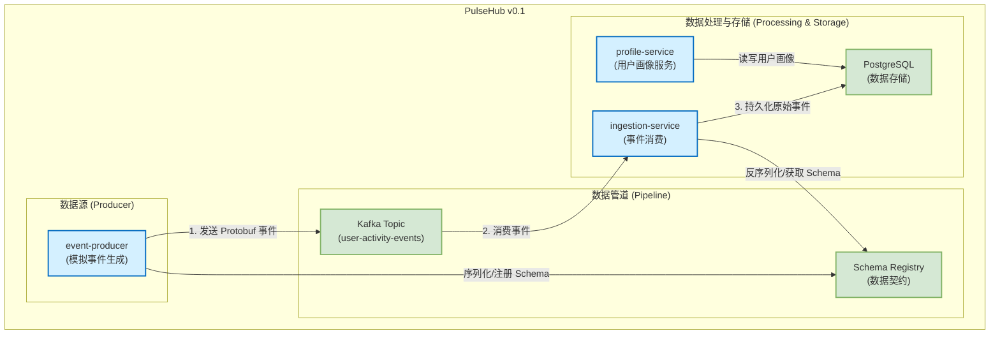
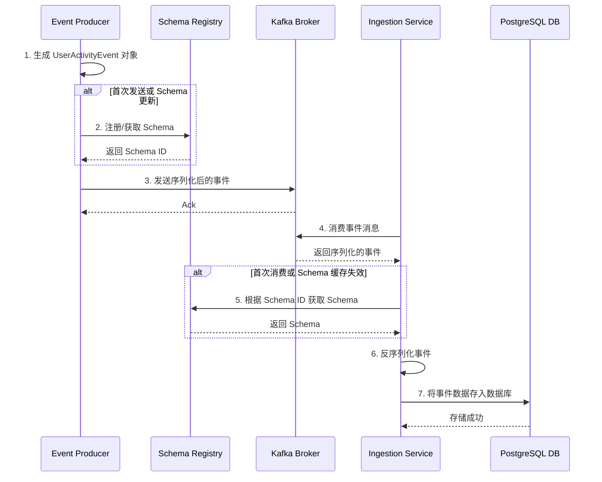

# PulseHub v0.1 版本总结

## 1. v0.1 概览：我们实现了什么？

在 v0.1 版本中，我们专注于搭建一个稳固、可扩展的骨架。这个骨架是未来所有 CDP（客户数据平台）功能的基础。

**核心实现包括：**

- **多模块项目结构**：我们建立了一个基于 Maven 的多模块项目，将系统划分为独立的微服务 (`event-producer`, `ingestion-service`, `profile-service`) 和一个共享模块 (`common`)。这种结构有利于独立开发、部署和扩展。
- **事件驱动的基础设施**：我们使用 Docker Compose 搭建并配置了全套基础设施，实现了服务之间的解耦和异步通信。
- **端到端的数据管道**：我们成功实现了一个完整的数据流：
    - `event-producer` 服务可以模拟生成用户活动事件。
    - 事件通过 **Protobuf** 格式进行序列化，并发送到 **Kafka** 主题。
    - `ingestion-service` 服务从 Kafka 消费这些事件。
    - 经过反序列化后，事件数据被成功持久化到 **PostgreSQL** 数据库中。
- **服务化的雏形**：`profile-service` 已经建立，并连接到数据库。虽然它目前功能简单，但为未来构建统一用户画像服务打下了基础。
- **统一的数据模型**：通过在 `common` 模块中使用 **Protobuf** 和 **Schema Registry**，我们确保了跨服务数据格式的一致性和演进能力。

## 2. 基础设施及其未来用途

我们搭建的基础设施是任何现代数据平台的核心。它们不仅支撑了 v0.1 的功能，更为未来的扩展做好了准备。

-   **Apache Kafka (事件总线)**
    -   **当前用途**：作为 `event-producer` 和 `ingestion-service` 之间的异步消息队列，传输用户活动事件。
    -   **未来用途**：它将是整个 PulseHub 的"中央神经系统"。未来所有的数据源（如网站点击流、移动 App 事件、后端服务日志、CRM 数据同步等）都将通过 Kafka 汇入平台。同时，它也会将处理后的数据分发给需要实时消费数据的下游系统（如实时看板、风控引擎、营销自动化工具等）。

-   **PostgreSQL (数据存储)**
    -   **当前用途**：存储从 Kafka 消费的原始事件数据。
    -   **未来用途**：它将演变成一个多功能的数据库。除了存储原始事件，它还将用于存储经过处理和整合后的 **用户画像 (User Profiles)**、用户分群信息、营销活动结果等。对于大规模数据，我们未来可能会引入更适合分析的列式存储数据库（如 ClickHouse）或数据仓库。

-   **Confluent Schema Registry (模式注册中心)**
    -   **当前用途**：管理和校验 `UserActivityEvent` 的 Protobuf schema，确保生产者和消费者之间的数据契约。
    -   **未来用途**：随着接入的数据源增多、事件类型变得复杂，Schema Registry 将变得至关重要。它可以防止"坏数据"进入系统，并允许我们在不中断服务的情况下平滑地升级事件格式，保证了整个数据生态系统的健壮性。

## 3. 系统架构图

这张图展示了 v0.1 系统的高层架构和组件之间的关系。

## 4. 事件处理时序图

这张图详细描述了一个用户活动事件从产生到最终被存储的完整生命周期。

