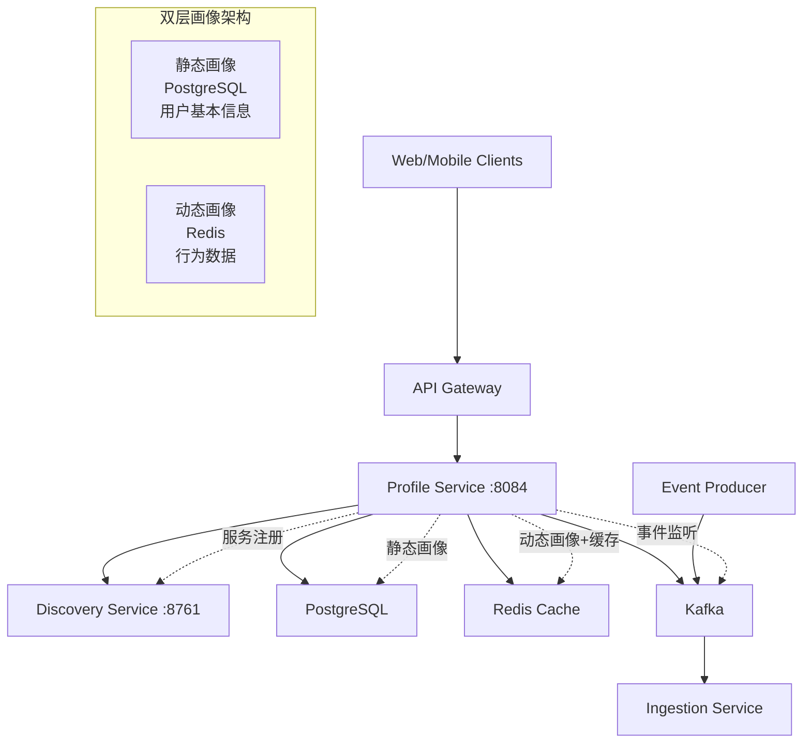

# 用户档案服务 (Profile Service)

## 功能描述

用户档案服务是PulseHub CDP平台的核心服务，实现了双层画像架构，负责管理用户的静态信息和动态行为数据。主要功能包括：

### 核心特性
- **双层画像架构**: 
  - **静态画像**: PostgreSQL存储用户基本信息（姓名、邮箱、年龄段、注册渠道等）
  - **动态画像**: Redis存储高频更新的行为数据（页面浏览、设备分类、活跃状态等）
- **企业级缓存策略**: 基于业务场景的分层缓存配置
  - CRM场景: 10分钟TTL，实时性优先
  - Analytics场景: 4小时TTL，性能优先
  - 用户行为: 30分钟TTL，平衡实时性和性能
  - 系统配置: 24小时TTL，稳定性优先
- **高性能Redis操作**: 
  - 支持Java 8时间类型的优化序列化
  - 批量操作和Pipeline支持
  - 自动TTL清理和活跃用户索引
- **事件驱动架构**: 支持Kafka事件监听和Spring Events
- **设备分类智能**: 自动识别和分类用户设备类型
- **数据版本控制**: 支持乐观锁和数据版本追踪

## API 端点

### 服务信息
- **默认端口**: 8084 (可通过`PROFILE_SERVICE_PORT`环境变量配置)
- **健康检查**: http://localhost:8084/actuator/health
- **Prometheus监控**: http://localhost:8084/actuator/prometheus

### 静态用户画像 API
基础用户信息管理（已废弃的旧版接口，保持向后兼容）:
- `POST /api/v1/profiles` - 创建用户档案
- `GET /api/v1/profiles/{userId}` - 查询用户档案  
- `GET /api/v1/profiles/exists/{userId}` - 检查用户是否存在

### 动态用户画像 API  
高频行为数据管理:
- `POST /api/v1/dynamic_profiles` - 创建/更新动态画像
- `GET /api/v1/dynamic_profiles/{userId}` - 获取动态画像
- `POST /api/v1/dynamic_profiles/{userId}/{pageViews}` - 增加页面浏览计数

## 系统架构

用户档案服务在PulseHub CDP平台中的位置和数据流：



### 数据流向
1. **静态画像流程**: 用户注册 → PostgreSQL存储 → 缓存到Redis
2. **动态画像流程**: 用户行为事件 → 实时更新Redis → 可选持久化
3. **缓存策略**: 分层TTL配置 → 业务场景优化 → 事件驱动失效

### 服务依赖
- **上游服务**: API Gateway, 其他微服务通过服务发现调用
- **下游依赖**: PostgreSQL(静态数据), Redis(动态数据+缓存), Kafka(事件), Eureka(注册)

## API 使用示例

### 创建动态用户画像
```http
POST /api/v1/dynamic_profiles HTTP/1.1
Host: localhost:8084
Content-Type: application/json

{
  "userId": "user123",
  "pageViewCount": 0,
  "device": "Mozilla/5.0 (iPhone; CPU iPhone OS 15_0 like Mac OS X) AppleWebKit/605.1.15"
}
```

### 查询动态画像
```http
GET /api/v1/dynamic_profiles/user123 HTTP/1.1
Host: localhost:8084
```

响应示例:
```json
{
  "userId": "user123",
  "lastActiveAt": "2024-12-29T10:30:45.123Z",
  "pageViewCount": 25,
  "deviceClassification": "MOBILE_IOS",
  "recentDeviceTypes": ["MOBILE_IOS", "DESKTOP_CHROME"],
  "version": 5,
  "updatedAt": "2024-12-29T10:30:45.123Z"
}
```

### 增加页面浏览计数
```http
POST /api/v1/dynamic_profiles/user123/5 HTTP/1.1
Host: localhost:8084
```

## 技术栈与配置

### 核心技术
- **Java 21** + **Spring Boot 3.x** + **Virtual Threads**
- **Spring Data JPA** + **PostgreSQL** (静态画像存储)
- **Spring Data Redis** + **Redis** (动态画像+企业级缓存)
- **Spring Kafka** + **Protobuf** (事件处理)
- **Spring Cloud Eureka** (服务注册发现)
- **Jackson** + **Java Time Module** (JSON序列化)

### 环境变量配置

| 环境变量 | 描述 | 默认值 |
|----------|------|--------|
| `PROFILE_SERVICE_PORT` | 服务运行端口 | `8084` |
| `SPRING_PROFILES_ACTIVE` | 运行环境profile | `local` |
| `POSTGRES_HOST` | PostgreSQL主机 | `localhost`/`postgres` |
| `POSTGRES_PORT` | PostgreSQL端口 | `5432` |
| `POSTGRES_DB` | 数据库名 | `pulsehub` |
| `POSTGRES_USER` | 数据库用户 | `pulsehub` |
| `POSTGRES_PASSWORD` | 数据库密码 | `pulsehub` |
| `REDIS_HOST` | Redis主机地址 | `redis` |
| `REDIS_PORT` | Redis端口 | `6379` |
| `KAFKA_BOOTSTRAP_SERVERS` | Kafka地址 | `kafka:29092` |
| `EUREKA_URI` | Eureka注册中心 | `http://localhost:8761/eureka` |

### Spring Profiles
- `local`: 本地开发环境
- `docker`: Docker容器环境  
- `test`: 测试环境(使用H2+嵌入式Redis)

## 缓存架构详解

### 企业级分层缓存策略

| 缓存层级 | TTL | 空值策略 | 使用场景 | Redis前缀 |
|----------|-----|----------|----------|----------|
| `crm-user-profiles` | 10分钟 | 不缓存空值 | 销售/营销/客服 | `pulsehub:crm:` |
| `analytics-user-profiles` | 4小时 | 缓存空值 | 报表/BI分析 | `pulsehub:analytics:` |
| `user-behaviors` | 30分钟 | 不缓存空值 | 行为追踪/推荐 | `pulsehub:behavior:` |
| `system-configs` | 24小时 | 缓存所有值 | 配置管理/元数据 | `pulsehub:config:` |

### 动态画像Redis存储
- **存储模式**: `dynamic_profile:{userId}`
- **序列化**: 优化的JSON序列化器(支持Java 8时间类型)
- **TTL策略**: 默认7天自动过期
- **索引支持**: 活跃用户索引、设备分类索引、页面浏览排行
- **批量操作**: Redis Pipeline支持高并发写入

## 性能特性

### 高并发支持
- **Java 21 Virtual Threads**: 高效处理I/O密集型操作
- **Redis连接池**: Jedis连接池优化(max-active=8)
- **异步处理**: `@Async`注解支持异步任务执行
- **重试机制**: `@Retryable`注解支持故障重试

### 数据一致性
- **乐观锁**: JPA `@Version`注解防止并发更新
- **缓存同步**: 事件驱动缓存失效机制
- **原子操作**: Redis Lua脚本保证操作原子性
- **软删除**: 支持数据审计和恢复需求

### 监控与运维
- **健康检查**: Actuator健康检查端点
- **指标监控**: Prometheus集成(预留)
- **定时清理**: 自动清理过期动态画像数据
- **分布式锁**: 防止并发执行定时任务

## 开发指南

### 关键类说明
- `DynamicProfileService.java`: 动态画像核心服务，Redis高性能操作
- `StaticProfileService.java`: 静态画像服务，PostgreSQL数据管理
- `ProfileController.java`: 静态画像REST API(已废弃)
- `DynamicUserProfileController.java`: 动态画像REST API
- `CacheConfig.java`: 企业级缓存配置，分层缓存策略
- `OptimizedRedisConfig.java`: 优化的Redis配置，Java 8时间支持
- `DynamicUserProfile.java`: 动态画像领域模型
- `StaticUserProfile.java`: 静态画像实体，完整用户信息

### 最佳实践
1. **缓存选择**: 根据业务场景选择合适的缓存配置
2. **数据分离**: 静态信息用PostgreSQL，动态数据用Redis
3. **版本控制**: 利用版本号进行并发控制
4. **事件驱动**: 通过事件实现缓存同步和数据一致性
5. **性能优化**: 合理使用批量操作和Pipeline

该服务作为PulseHub CDP平台的核心数据服务，提供企业级的用户画像管理能力，支持高并发、高可用的业务需求。